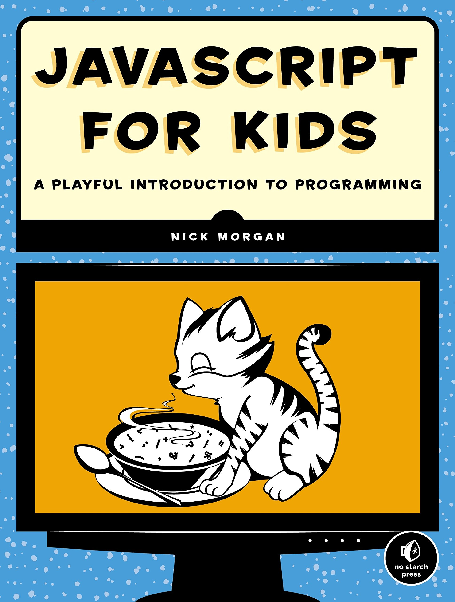

# JavaScript для детей

*Самоучитель по программированию*

## О JavaScipt

**JavaScipt** — это язык программирования веб-страниц, тот самый ингредиент, который делает сайты интерактивными. Эта книга позволит вам погрузиться в программирование и с легкостью освоить JavaScript. На каждом шаге вы будете видеть результаты своих трудов в виде работающей программы. 

## Из книги вы узнаете как:
* использовать основные элементы **JavaScript**: `базовые типы`, `операторы`, `массивы` и `функции`;
* создавать веб-страницы с помощью **HTML**;
* делать веб-страницы интерактивными;
* рисовать при помощи **JavaScript**;
* написать собственную игру - **поиск сокровищ на карте**, **«Виселицу»** и **«Змейку»**
* в конце книги Ник дает рекомендации по тому, куда можно развивать полученные навыки и как использовать язык
* все **английские термины** (которых в программировании не избежать!) вынесены на поля, что делает книгу крайне удобной в использовании и помогает учить язык

Книгу можно скачать [здесь](https://t.me/python_books_archive/273).

`Исходный код` к упражнениям и задачам из книги, вы найдете в соответствующих папках этого репозитория.

Happy coding 🥳